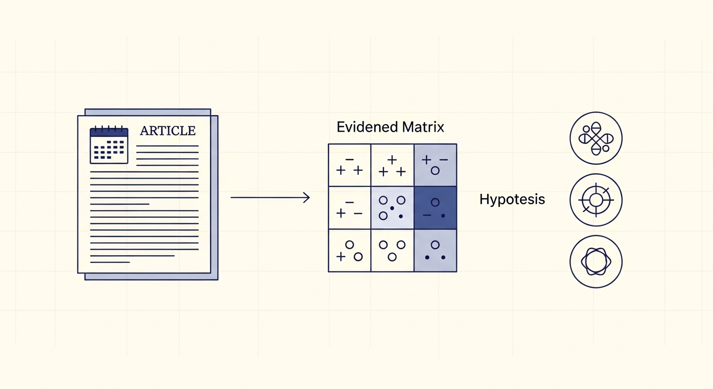

<p align="center">
  
</p>

# Evidence Matrix Reasoning: Structured Hypothesis Selection via Analysis of Competing Hypotheses

**EMR-ACH** turns LLM forecasting into a structured analysis-matrix problem. Instead of asking a model to pick a hypothesis from a question and a bag of articles in a single forward pass, we decompose the task into three small, auditable steps that mirror Heuer's *Analysis of Competing Hypotheses* method from the intelligence community.

> **Authors.** Ben Remez, Yehudit Aperstein, Alexander Apartsin
> **Paper.** [`paper/index.html`](paper/index.html)
> **Tag.** `v2.1-data-ready`

---

## The method

Given a Forecast Dossier (FD) — a question, a fixed hypothesis set $\mathcal{H} = \{h_1, \dots, h_K\}$, and a bundle of pre-event articles $\mathcal{A}$ — EMR-ACH builds two matrices:

| Matrix | Shape | Cell meaning |
|---|---|---|
| **Analysis matrix** $A$ | $\mathcal{A} \times \text{indicators}$ | Does article $i$ manifest indicator $j$? |
| **Influence matrix** $I$ | $\text{indicators} \times \mathcal{H}$ | How strongly does indicator $j$ imply hypothesis $k$? |

The score for hypothesis $h$ is

$$ \mathrm{Score}(h) \;=\; \sum_{i}\sum_{j}\, d_j \cdot A_{ij} \cdot I_{jh} $$

with **diagnosticity weight** $d_j$ amplifying indicators whose influence row discriminates between hypotheses (those with high variance in $I_{j\cdot}$). The final pick is

$$ \hat{h} \;=\; \arg\max_{h \in \mathcal{H}} \mathrm{Score}(h). $$

A multi-agent adversarial variant adds one advocate agent per hypothesis and lets a judge agent override the aggregation. No probability distribution, no calibration: every system in the comparison emits a single label per FD.

Pipeline: see Figure 1 in the [paper](paper/index.html).

---

## Why structured matters

LLMs collapse "enumerate hypotheses + score evidence + commit" into one forward pass. Even trained human analysts struggle with this; ACH was designed exactly to split it into small, auditable sub-decisions. EMR-ACH applies the same decomposition to LLMs:

- **Indicator generation is contrastive.** Each indicator is forced to differentiate at least two hypotheses; vague "applies-to-everything" indicators get filtered out.
- **Scoring is local and concrete.** "Does this article mention military exercises along the border?" is reliably answerable; "what will happen?" is not.
- **Diagnostic weighting is automatic.** Indicators that don't separate hypotheses get $d_j \approx 0$ and contribute no noise to the argmax.
- **Multi-agent debate is targeted.** One advocate per hypothesis, one judge — not free-form back-and-forth.

The full ablation in [paper/index.html §6.4](paper/index.html) isolates each contribution.

---

## The benchmark (used to evaluate the method)

We need a benchmark that measures forecasting capability without leaking the answer. Two structural contaminations had to go:

1. **Resolution leakage** — questions whose resolution date sits inside the model's training cutoff.
2. **Article-pool leakage** — retrieved articles published *after* the simulated forecasting decision.

The EMR-ACH benchmark is built around three FD tracks under one schema, with leakage handled by construction:

| Track | n FDs (v2.1) | Domain | Primary target |
|---|---:|---|---|
| `forecastbench` | 134 | Public-interest forecasting markets | Comply / Surprise |
| `gdelt-cameo` | 5,975 | Geopolitical event intensity | Comply / Surprise (also Peace / Tension / Violence) |
| `earnings` | 185 | S&P 500 earnings | Comply / Surprise (also Beat / Meet / Miss) |

Both invariants below are verified at publish time and re-asserted at evaluation:

$$ t_r - t_f = h \quad (h = 14\text{ days in v2.2}) $$
$$ \forall a \in \texttt{article\_ids}: \quad \texttt{publish\_date}(a) \le t_f $$

The benchmark exists to compare EMR-ACH against a battery of nine reproducible baselines (B1-B9) on a shared pick-only response contract — full details in [`benchmark/evaluation/BASELINES.md`](benchmark/evaluation/BASELINES.md). A curated **gold subset** under each cutoff ships fully self-contained: schema, validators, example loaders, LICENSE, CITATION inline.

---

## Forecast Dossier

```jsonc
{
  "id": "earn_AAPL_2026-01-30",
  "benchmark": "earnings",
  "question": "Will Apple's Q1 FY26 EPS surprise be Beat / Meet / Miss?",
  "hypothesis_set": ["Comply", "Surprise"],
  "ground_truth": "Comply",
  "forecast_point":   "2026-01-16T00:00:00Z",   // resolution_date − 14d
  "resolution_date":  "2026-01-30T20:30:00Z",
  "article_ids": ["art_a995…", "art_e394…", ...],  // every one passes leakage
  "prior_state_30d": "guidance reaffirmed; consensus 2.10 EPS",
  "fd_type": "stability",
  "metadata": {"ticker": "AAPL", "x_multiclass_gt": "Meet", ...}
}
```

Full schema: [`docs/FORECAST_DOSSIER.md`](docs/FORECAST_DOSSIER.md).

---

## Event Timeline Dossier (ETD)

EMR-ACH's evidence layer is article-level by default, but every benchmark cutoff also ships an **Event Timeline Dossier**: articles distilled into atomic dated facts that can be deduplicated, linked, and reasoned over independently.

| Stage | Script | What it does |
|---|---|---|
| 1 | `articles_to_facts.py` | LLM extraction of (subject, predicate, time, polarity) tuples |
| 2 | `etd_dedup.py` | Date-bucketed FAISS kNN canonicalisation (8 sec for 78k facts) |
| 3 | `etd_link.py` | Per-cutoff linkage to FDs via `primary_article_id` |

Headline ablation: B3 articles-only vs B10 hybrid (articles + facts) vs B10b facts-only — paper Table 6.

---

## Baselines on a shared pick-only contract

Every baseline returns one hypothesis label per FD (no probability distribution). Multi-sample methods aggregate via plurality vote; ties broken by `hypothesis_set` order.

| ID | Method | Calls / FD | Reference |
|---|---|---|---|
| B1 | Direct prompting | 1 | Brown et al. 2020 |
| B2 | Chain-of-Thought (ACH-style) | 1 | Wei et al. 2022 |
| B3 | RAG-only | 1 | Lewis et al. 2020 |
| B4 | Self-Consistency | $n_s$ | Wang et al. 2022 |
| B5 | Multi-Agent Debate | $n_a \cdot n_r$ | Du et al. 2023 |
| B6 | Tree of Thoughts | $b + b^d$ | Yao et al. 2023 |
| B7 | Reflexion | $1 + 2(n_i-1)$ | Shinn et al. 2023 |
| B8 | Verbalized Confidence (deprecated) | 1 | Lin et al. 2022 |
| B9 | Heterogeneous LLM Ensemble | $\lvert c \rvert$ | Jiang et al. 2023 |
| — | Majority-class reference | 0 | this work |

---

## Quickstart

```bash
# Build a benchmark cutoff (one command, full pipeline)
python scripts/build_benchmark.py --cutoff 2026-01-01 \
    --benchmarks forecastbench,earnings \
    --horizon-days 14 --lookback-days 30 \
    --embedder openai --openai-mode batch

# Build a self-contained gold subset
python scripts/build_gold_subset.py --cutoff 2026-01-01 \
    --min-articles 5 --min-distinct-days 3 --min-source-diversity 2

# Run EMR-ACH on the gold subset
python scripts/eval/emrach_on_gold.py \
    --gold-dir benchmark/data/2026-01-01-h14-ccnews-gold \
    --mode batch

# Smoke a baseline
cd benchmark && python -m evaluation.baselines.runner \
    --method b1_direct \
    --fds data/2026-01-01-gold/forecasts.jsonl \
    --articles data/2026-01-01-gold/articles.jsonl \
    --smoke 3 --sync

# Full B1-B9 Batch API run (≈ $0.30 for 10 methods × 80 FDs)
python -m evaluation.baselines.runner --method b1_direct --batch ...
```

---

## Repository layout

```
ACH/
├── paper/index.html                    ← HTML paper (Tables 1-7, Appendices A-G)
├── paper/figures/                      ← 8 paper figures, embedded in §3 + §6
├── docs/PROJECT_SPEC.md                ← single source of truth
├── docs/V2_2_REFACTOR_BACKLOG.md       ← 80-item living backlog
├── docs/FORECAST_DOSSIER.md            ← FD schema + invariants
├── docs/EMRACH_IMPLEMENTATION_AUDIT.md ← method-side component audit
├── benchmark/
│   ├── DATASET.md                      ← schema + EDA + horizon/lookback config
│   ├── configs/                        ← default_config.yaml, baselines.yaml
│   ├── schema/                         ← FD + article + ETD JSON Schemas
│   ├── evaluation/baselines/           ← B1..B9 + runner
│   └── data/{cutoff}/ + {cutoff}-gold/ ← published benchmark + gold subset
├── src/
│   ├── pipeline/                       ← EMR-ACH method modules (indicators, retrieval, multi-agent)
│   └── common/openai_embeddings.py     ← Batch API helper
├── scripts/                            ← every pipeline stage as a CLI
└── tests/                              ← invariants + leakage regression
```

---

## Versions

| Tag | Status | What it is |
|---|---|---|
| `v2.1-data-ready` | shipped | 6,294 FDs, 28,945 articles, 81-FD gold. Horizon=0 retrospective. Tagged `8ffba6f`. |
| `v2.2-h14` (in progress) | local | Horizon=14, lookback=30, fb+earnings. Reuse-first (89 FDs) + CC-News rebuild (89 FDs, 1,209 articles, 5,956 ETD facts). EMR-ACH runs end-to-end on the v2.2 gold subset. |
| `v2.2-data-ready` (next) | TBD | After Phase-3 batch fills paper Tables 5 / 6 / 7 with real numbers. |

---

## Reproducing

The pipeline is fully reproducible from public sources:

- **forecastbench** ← upstream ForecastBench repo (resolved questions only).
- **gdelt-cameo** ← GDELT 2.0 KG (publicly hosted).
- **earnings** ← yfinance + Finnhub + EDGAR + GDELT-slug + NYT/Guardian editorial.
- **CC-News** ← Common Crawl `data.commoncrawl.org/crawl-data/CC-NEWS/{YYYY}/{MM}/`.

No GPU required. Every stage routes through OpenAI Batch API or CPU pipelines (FAISS-CPU). Total reproducibility budget per cutoff-month is under $10.

---

## Citation

```
Remez B., Aperstein Y., Apartsin A.
Evidence Matrix Reasoning: Structured Hypothesis Selection via Analysis of Competing Hypotheses.
2026. https://github.com/ApartsinProjects/EMR-ACH (tag v2.1-data-ready)
```

Code: MIT. Third-party data (GDELT, Yahoo Finance, ForecastBench upstream, Common Crawl, NYT, Guardian) retains its original upstream licence.
